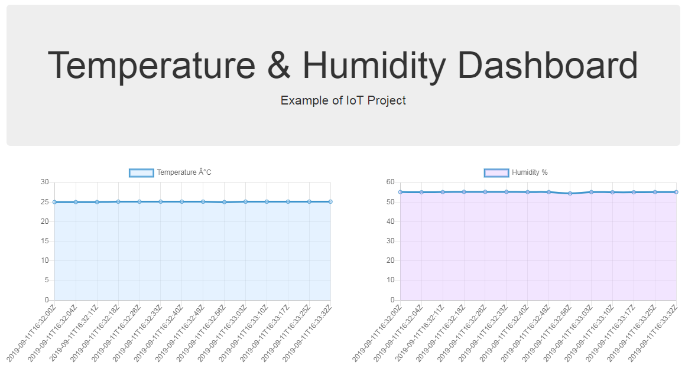
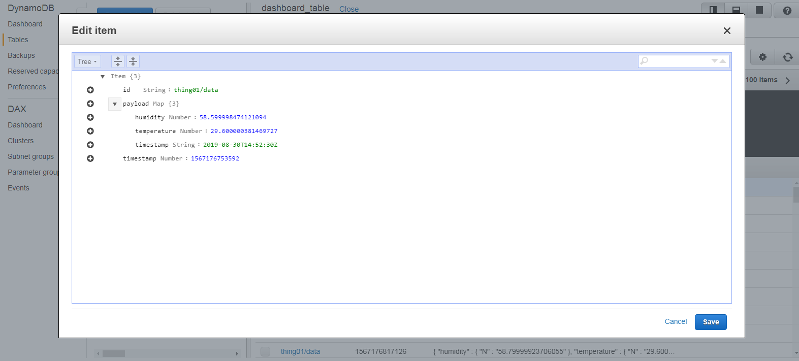

# Simple IoT Dashboard using AWS Technologies
There is to many ways to plot sensor in real time, after searching a lot of information this is the way a figure out how
to plot humidity and temperature data in real time.

##### Hardware Technologies I used:
* Rasperry Pi 3 Model B+
* DTH22 Sensor

##### Sofware Technologies I used:
* BackEnd:
    * AWS IoT
    * AWS SDK for Python
    * S3 Bucket 
    * AWS IAM
* Database:
    * AWS DynamoDB
* FrontEnd:
    * CSS (Boostrap)
    * HTML
    * JavaScript and ChartJS
    
Now I will try to explain how every technology fit together and also will give the link reference if you want to do something similar. 

1.  With AWS SDK for python installed in my raspberry pi and the correct implementation of AWS IoT to get the certification device
I am able to run the script [realdataPub14.py](realdataPub14.py) inside my raspberry pi to send de humidity and temperature data in
a JSON format it suit to my needs. 
More info if you want to implement this part:
    *  https://github.com/aws-samples/aws-iot-office-sensor/tree/master/sensor

2. AWS IAM. This is to create a user that have access to dynamoDB. This is not a good practice, is better to use AWS cognito, but for education
purpose a I did it this way. You can change the key access if you going to share the code or published on internet. 

This is the part you put you credential in the script [practicas.js](practicas.js)
```
AWS.config.update({
  region: "us-east-1",
  // The endpoint should point to the local or remote computer where DynamoDB (downloadable) is running.
  endpoint: 'https://dynamodb.us-east-1.amazonaws.com ',
  /*
    accessKeyId and secretAccessKey defaults can be used while using the downloadable version of DynamoDB.
    For security reasons, do not store AWS Credentials in your files. Use Amazon Cognito instead.
  */
  accessKeyId: "XXXXXXXXXXXXXXXXXXXXXXXXXXXXXXXXX",
  secretAccessKey: "XXXXXXXXXXXXXXXXXXXXXXXXXXXXXXXXX"
});
```


 

This full access policy is just for learning purpose. Instead of using cognito, you can create a policy that only have permission to read... 

3. The S3 bucked is for host you web. To make a serverless application. To have more info just google how to host a web in AWS S3. 

4. AWS DynamoDB is for store all the data I send. With AWS IoT a create a rule that send all the information to DynamoDB. 
 

5. JavaScript and ChartJS is the part that handle all the graph and the interaction with DynamoDB querying and scanning the data.
 
 More resource I use to do this simple project:
    * https://docs.aws.amazon.com/amazondynamodb/latest/developerguide/GettingStarted.JavaScript.html
    * https://hackernoon.com/building-an-iot-dashboard-using-the-onion-omega-and-amazon-aws-a3520f850c9

